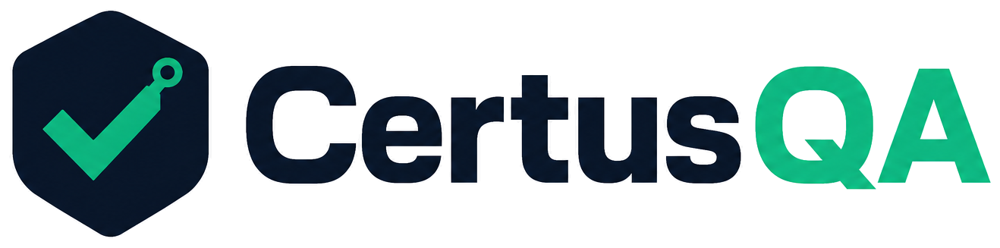

<p align="center">
  
</p>

# DeployShield Demo — Green Before Deploy

Public proof of what [CertusQA](https://certusqa.com) delivers with **The DeployShield Suite**: Playwright regression on critical flows, wired into GitHub Actions so a bad build cannot ship quietly.

**Outcome:** CI stays green, or deploy is blocked with failure artifacts (screenshots, video, HTML report, Slack/Jira-shaped alert payload).

**Target app:** [Sauce Demo](https://www.saucedemo.com) — practice stand-in for a client staging environment (public credentials only).

## CI status

[](https://github.com/certusqa/deployshield-demo/actions/workflows/playwright.yml)

| Result | Meaning |
|--------|---------|
| Green | **Deploy cleared** — critical flows passed |
| Red | **Deploy blocked** — open the workflow artifacts for the failure report |

## What's covered (6 tests)

1. User login — valid credentials  
2. User login — locked-out user error  
3. Cart — add item  
4. Cart — remove item  
5. Checkout — full purchase flow  
6. Checkout — missing postal code (negative path)

## What this maps to in the product

| Demo | DeployShield Suite ($2,500/mo) |
|------|--------------------------------|
| 6 Sauce Demo flows | Up to 15 Playwright flows on your staging app |
| GitHub Actions gate | CI/CD green-before-deploy |
| Screenshots / video / HTML report + Slack/Jira-shaped `alert:payload` | Slack / Jira failure artifacts |
| Page objects + fixtures | Same delivery shape we install in client repos |

This repo is the **base** sales proof. It does not include GenAI self-heal or Proof Artifacts (those are DeployShield Premium / private engine).

## Run locally

```bash
cd practice-client
npm install
npx playwright install chromium
npm test
```

**Node:** 18–22 (LTS). GitHub Actions uses Node 20.

```bash
npm run test:report   # HTML report after a run
npm run alert:payload # Slack/Jira-shaped JSON from last results (no live bots)
```

## Learn more

- **Product:** [certusqa.com](https://certusqa.com)  
- **Suite:** DeployShield — regression coverage, CI gate, Green Build Guarantee  
- **Contact:** hello@certusqa.com  
